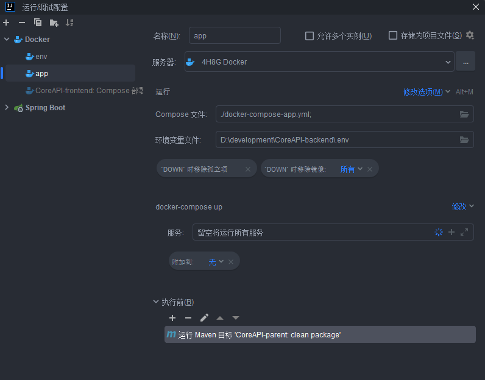

## 项目介绍

`CoreAPI` 是一个为开发者提供可调用接口的开放平台，支持从接口接入、文档生成到调用监控的全流程管理。在线地址：http://1.15.122.131:8000

### 核心功能

- **开发者功能**
    - 邮箱注册 / 登录
    - 浏览接口列表与文档
    - 在线调试接口
    - 申请并管理密钥（AK/SK）
    - 通过 SDK 调用接口
    - 关键词搜索接口
- **管理员功能**
    - 接入并管理 API
    - 控制接口上下线状态
    - 绑定 OpenAPI 文档 URL，自动生成接口文档与请求/响应示例
    - 管理接口信息、文档和黑名单
    - 可视化展示接口调用情况（调用次数、请求耗时等）
- **平台能力**
    - 网关限流（防止恶意或超量访问）
    - 黑名单机制（屏蔽违规访问）
    - 调用日志记录并存储到 Elasticsearch，用于后续检索与分析

## Docker部署

1. 拉取代码

   ```bash
   git clone https://your.repo/CoreAPI-backend.git
   ```

2. 修改项目根目录环境变量文件`.env`

3. 修改邮件服务配置：`CoreAPI-main/src/main/resources/config/mail.setting`

4. IDEA 打开`CoreAPI-backend`

    - 连接 Docker
    - 创建两个 Compose 运行配置，分别绑定`docker-compose-env.yml `和`docker-compose-app.yml`
    - 指定环境变量文件为`.env`
    - 在执行前添加 Maven 命令：在`CoreAPI-parent`模块执行`clean package`
    - 启动`env`后启动`app`

   

> Docker 如果在远程服务器，建议以指定**环境变量**替代指定**环境变量文件**

## 导航

- [CoreAPI-backend](https://github.com/coreQAQ/CoreAPI-backend)
- [CoreAPI-frontend](https://github.com/coreQAQ/CoreAPI-frontend)
- [CoreAPI-sdk](https://github.com/coreQAQ/CoreAPI-sdk)

## 技术栈

### 前端

- React
- Ant Design Pro
- Ant Design、Pro Components
- umi request

### 后端

- Spring Boot
- Spring Cloud Gateway
- MySQL、Redis
- Dubbo、Nacos
- Mybatis Plus、Redisson
- ElasticSearch、Kibana
- Kafka
- Knife4j
- FreeMarker
- hutool、Apache Common Utils


